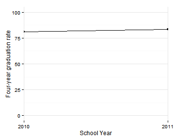
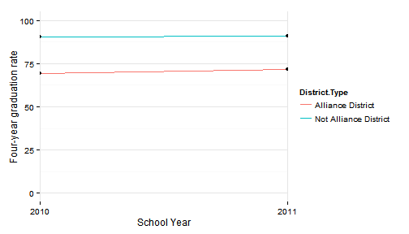
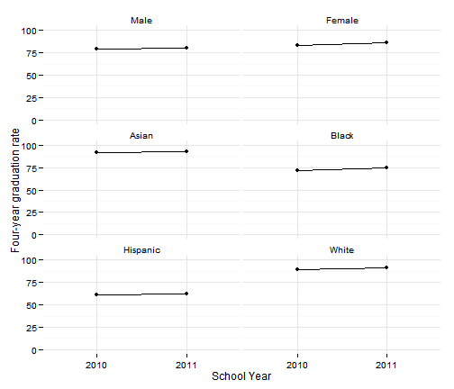
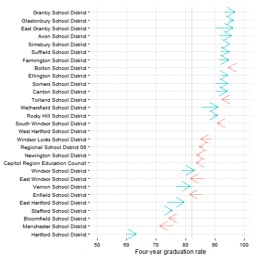
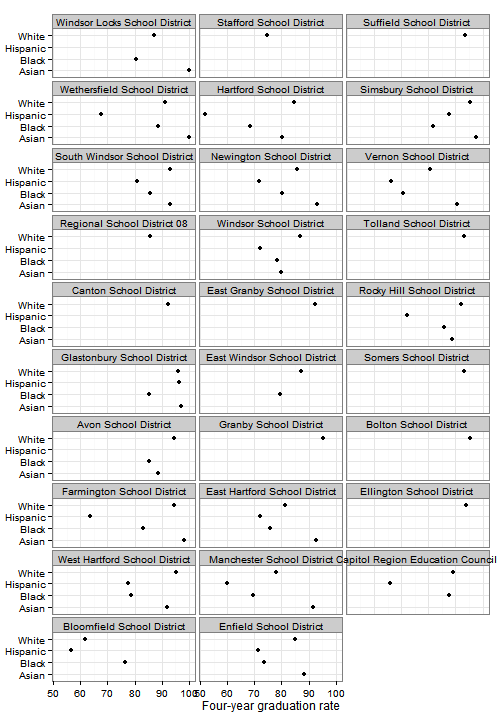
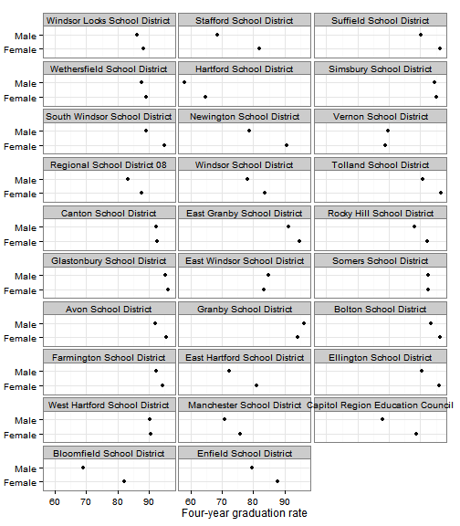
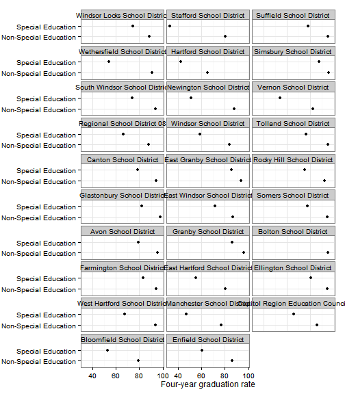
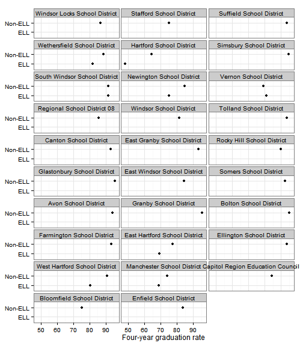
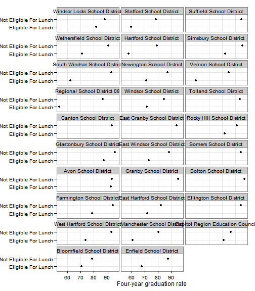
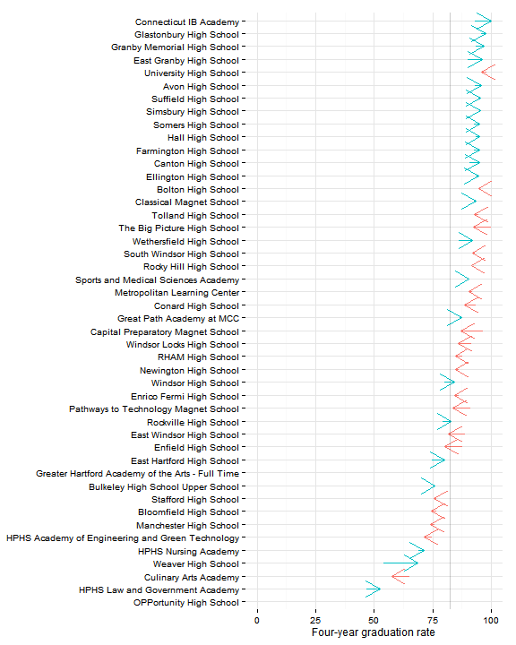

## Data and limitations

Graduation rates in Connecticut are [reported by SDE](http://sdeportal.ct.gov/Cedar/WEB/ResearchandReports/DataBulletins.aspx). Beginning in 2011, cohort graduation rates are published, meaning the rates take into account dropouts and other changes from 9th through 12th grade. Documentation for the cohort graduation rates calculation is [here](http://sdeportal.ct.gov/Cedar/Files/Pdf/Reports/cohortgraddocumentation.pdf)

The data as it currently stands has a few limitations. 
* The data is two years old - the most recent data is for 2011. 
* Since cohort graduation rates are new, we only have two years of data available. 
* SDE releases data by district and by school. To roll this up for regional (or other aggregated) results, we need to know the 'cohort counts' - the number of students in each cohort in the region. However the cohort counts have not been published by SDE. In the sample results below total enrollment across all grades was used in place of the cohort counts, so any regional results should be treated as approximate for the time being.

Given the caveats above, we can still look at the 2010-11 graduation data. 

## What do we already know?

Below are references for some local, regional and national reports that use high school graduation rates, with some details on how the data is used. 

### Local

* [CETC Report Card](http://www.ctdol.state.ct.us/OWC/CETC/2013ReportCard.pdf): The Report Card covers graduation rates for the state, noting that "Connecticut appears to have made very little progress in on-time graduation rates over the past 5 years. In addition, the disparity between white and minority graduation rates has improved only marginally." The report has 2012 data for the state. 
* [CT Kids Report Card](http://www.cga.ct.gov/kid/rba/results.asp): Graduation rates appear under the 'Future Success' domain although the ['spotlight indicator'](http://www.cga.ct.gov/kid/rba/Docs/2013/FINAL%20Jan%202013%20Annual%20Report%20on%20PA%2011-109%20CT%20Children%27s%20%20Report%20%20Card.pdf) for this domain is 3rd grade reading.
* [CWP Community Workforce Development Report Card](http://www.capitalworkforce.org/ctworks/documents/Community_Workforce_Development_Report_Card_2011ff.pdf): Graduation rates are reported for the state and the City of Hartford.
* [Health Equity Index](http://www.cadh.org/health-equity/health-equity-index.html): CADH's health equity index includes graduation rates in the 'Education' domain. A [health needs assessment for Hartford](http://hhs.hartford.gov/Shared%20Documents/Community%20health%20needs%20assessment%202012.pdf) from 2012 uses the health equity index and refers to low graduation rates in Hartford as linked to health outcomes: "The strong correlations suggest that a higher educational attainment leads to better health throughout an individual’s lifespan."   
* [Population Results Working Group](http://www.ct.gov/opm/cwp/view.asp?a=2998&Q=490946): This working group has included graduation rates as a headline indicator, under 'Education,' with a special breakout for graduation rates for the disabled.  
* [KidsCount](http://www.cahs.org/kidscount.asp): includes graduation rates from SDE. The report commentary calls out that "the [district] data does not fairly reflect what is happening in the Hartford region" though, due to the Sheff reforms. 

### Other relevant efforts

* [Boston Indicators Project](http://www.bostonindicators.org/): The [most recent report](http://www.bostonindicators.org/~/media/Files/IndicatorsReports/Reports/Indicator%20Reports/Indicators2012.pdf) mostly covers wages and employment for high school graduates in the workforce.
* [Pioneer Valley State of the People](http://pvpc.org/resources/datastats/state-of-people/stateofthepeople2013.pdf): Looks at graduation rates by town and for the region, in the 'Education' section. (The region gets a 'D+.')
* [Rhode Island Community Foundation Dashboard](http://www.rifoundation.org/CommunityLeadership/CommunityDashboard/tabid/1157/Default.aspx): Uses four-year and six-year graduation rates. 

## Sample results

This section includes results for the most recent graduation rates data for the current 30-town CRCOG region. 

For the region, high school graduation rates improved between 2010 and 2011, from 81 to 83 percent. In other words, about 4 out of 5 students graduate within four years. 

 

Graduation rates were lower in the eight [Alliance Districts](http://www.sde.ct.gov/sde/cwp/view.asp?a=2683&Q=334226) in the region, around 70 percent, versus 90 percent in the remaining districts (which includes charter and magnet school districts). Rates improved in both sets of districts between 2010 and 2011. 

 

The same disparities can be seen for some of the other demographic breakouts available. By gender, female graduation rates are higher than male. By race / ethnicity, graduation rates for Hispanics are lowest in the region, with fewer than 2/3rds graduating on-time. Graduation rates for black students are around 75 percent. 

 

## District-level data

By district, rates range from around 95 percent (for Glastonbury and Granby) to close to 60 percent in Hartford. The Alliance Districts again have lower rates; Enfield and Stafford are the only non-Alliance districts with below-average graduation rates for the region. 

It appears that the better-performing districts generally improved over this period, while more of the worse-performing districts saw declines in graduation rates, indicating an increasing gap across districts.

 

Graduation rates are shared with the following additional breakouts: 
- Race / ethnicity
- Gender
- Special education
- English language learner (ELL)
- Eligibility for free / reduced-price lunch (as a proxy for household income)

The graphs below display data by district for each of these breakouts to allow a look at disparities by each factor. To simplify the display, the results are the average of graduation rates for the 2010 and 2011 academic years. 

By race / ethnicity: 

 

By gender: 

 

By special-education status: 

 

By ELL status: 

 

By eligibility for free / reduced-price lunch: 

 

And finally, since graduation rates are released for individual high-schools, we can look at the rates by school. 

 

